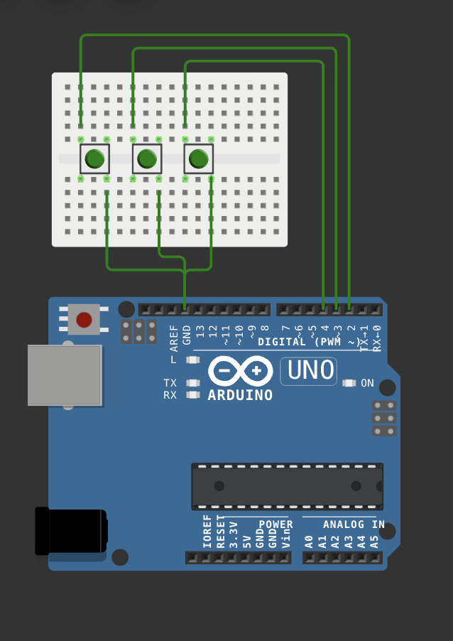

# Milestone 4 - Final Project: Arduino and p5.js Interactive Game

## Table of Contents
- [Overview](#overview)
- [System Diagram](#system-diagram)
- [FSM Diagram](#fsm-diagram)
- [Circuit Diagram](#circuit-diagram)
- [Components Used](#components-used)
- [External Libraries](#external-libraries)
- [Project Relevance](#project-relevance)
- [User Testing Feedback](#user-testing-feedback)
- [Video Demonstration](#video-demonstration)
- [Code Structure](#code-structure)

---

## Overview
This interactive project combines **Arduino** for physical input and **p5.js** for a visual experience to create a simple yet challenging game. Players use hardware buttons to move a player-controlled rectangle on the screen to avoid falling objects. The difficulty increases as the game progresses, with an audio-reactive component adjusting object sizes dynamically.

---

## Finite State Machine Diagram
        +-------------------+         
        |    GAME START     |         
        +-------------------+         
                   |                  
                   v                  
        +-------------------+         
        |   PLAYING STATE   |         
        |   - Move Player   |         
        |   - Generate Obj  |         
        +-------------------+         
                   |                  
      Collision Detected              
                   |                  
                   v                  
        +-------------------+         
        |   GAME OVER       |         
        |   - Display Score |         
        +-------------------+         
                   |                  
        Restart Button Pressed        
                   |                  
                   v                  
        +-------------------+         
        |   RESET GAME      |         
        +-------------------+         


---

## Circuit Diagram
The buttons are connected as follows:
- **Left Button** → Pin 2
- **Right Button** → Pin 3
- **Restart Button** → Pin 4



---

## Components Used
1. **Arduino Uno**
2. **Push Buttons** (3 buttons for Left, Right, Restart)
4. **Laptop** for p5.js display and audio output.

---

## External Libraries
1. **p5.Serial**: Enables communication between Arduino and p5.js.
2. **p5.Sound**: Used for background music and sound effects.
3. **p5.Image**: Handles image loading for the background.

---

## Project Relevance

### Relation to Readings
This project demonstrates the principles of **interactivity** and **feedback loops** discussed in class. By using serial communication and combining physical input with dynamic visuals/audio, it integrates real-world interaction into a digital experience.

### Societal Connection
The game explores the relationship between **reaction time** and **audio stimuli**, reflecting real-world scenarios like focus training for ADHD patients. It highlights the importance of integrating physical and digital components for engaging experiences.

### Personal Importance
This project resonates with my interest in creating **immersive experiences** and bridging the gap between hardware and software. It allowed me to showcase my technical and creative growth in the course.

---

## User Testing Feedback
User testing revealed the following insights:
1. **Positive**: Users enjoyed the increasing difficulty and audio-reactive visuals.
2. **Improvement**: Added a "Restart Button" for convenience after feedback.
3. **Gameplay Adjustments**: Balanced object speed and collision detection.

---

## Video Demonstration
[Link to Project Video](#)

---

## Code Structure

### Arduino Code
The Arduino reads button inputs and sends **LEFT**, **RIGHT**, or **RESTART** commands via the serial port to the p5.js sketch.

### p5.js Code
The p5.js sketch handles visual rendering, sound effects, and serial communication to control the player and game state. (File: p5_game.js)

---

## Final Thoughts
This project successfully demonstrates an integration of physical inputs (Arduino) and visual/audio outputs (p5.js), adhering to the course requirements while pushing creative and technical boundaries.

---

# **Final Project: Mini Arcade Game - Milestone 1**

## **Overview**
This project is a simple arcade-style game where players control an object (e.g., a spaceship or a character) using buttons connected to an Arduino. The game environment is displayed using p5.js and includes dynamic visuals, sound effects, and a scoring system. The objective is to navigate obstacles and collect items to achieve a high score. 

The project showcases a combination of physical computing and creative coding, integrating concepts learned throughout the course.

---

## **Features**
- **Physical Inputs**: A button connected to an Arduino for controlling the game.
- **Interactive Gameplay**: Players navigate through a game world with obstacles and collectible items.
- **Dynamic Visuals**: The game features animations and visual effects.
- **Sound Effects**: Includes audio feedback for actions like scoring or hitting obstacles.
- **Score Tracking**: A scoring system that keeps track of player performance.

---

## **Hardware Setup**
### **Arduino**
- **Inputs**: Buttons for directional movement, extra buttons for additional actions.
- **Outputs**: Sends input signals to p5.js via serial communication.

### **Components**
- Arduino (e.g., Arduino Nano 33 or Uno)
- Push buttons
- Wires and breadboard
- USB cable for connection

### **Schematic**


---

## **Software**
### **p5.js**
- **Game Environment**: Displays the game world and updates based on inputs from the Arduino.
- **Audio and Visual Effects**: Background music, sound effects, and animations.
- **Game Mechanics**:
  - Obstacle avoidance
  - Item collection
  - Scoring system


# **Milestone 2**

---

## **Features**
- **Physical Inputs**: 4 buttons connected to an Arduino.
- **Interactive Gameplay**: Players use buttons to move the character up and down, left and right to avoid obstacles.
- **Dynamic Visuals**: The game includes moving obstacles and score tracking.
- **Sound Effects**: Audio feedback enhances the gameplay experience.
- **Game Over Mechanic**: The game ends when the character collides with an obstacle.

---

## **Hardware Setup**
### **Components**
- Arduino Nano.
- 4 push buttons.
- 10kΩ resistors.
- Jumper wires and breadboard.
- USB cable for Arduino-PC communication.


---

## **Software Details**
### **Arduino**
- Reads button inputs.
- Sends button states to p5.js via serial communication.

### **p5.js**
- Displays the game interface.
- Responds to button inputs to control the character.
- Implements game mechanics like collision detection and scoring.

---

## **Game Description**
1. **Objective**: Avoid obstacles and achieve a high score.
2. **Controls**:
   - Button 1: Move character up.
   - Button 2: Move character down.
   - Button 3: Move left.
   - Button 4: Move right.
3. **Gameplay**:
   - The player moves the character to avoid obstacles.
   - Points are earned as obstacles are dodged.
   - The game ends upon collision with an obstacle.

---

## **Timeline**
| **Dates**       | **Task**                                 | **Deliverable**                       |
|------------------|------------------------------------------|---------------------------------------|
| Dec 2 - Dec 6    | Implement button input and serial communication | Button-controlled movement in p5.js. |
| Dec 7 - Dec 10   | Add obstacles and scoring system        | Playable prototype.                   |
| Dec 11 - Dec 13  | Enhance visuals and add sound effects   | Polished game.                        |
| Dec 14 - Dec 15  | Debug and finalize game                | Fully functional game.                |
| Dec 16           | Submit the project                     | Finalized submission.                 |

---

## **Code Structure**
### **Arduino Code**
- Handles button input and sends states via serial communication.
### **p5.js Code**
- Renders the game environment and processes inputs from Arduino.

---

**Algorithms:**

**Button Input Handling (Arduino):**

Debounce algorithm to avoid multiple detections for a single button press:

bool isButtonPressed(int pin) {
    static unsigned long lastPressTime = 0;
    const unsigned long debounceDelay = 50; // milliseconds
    if (digitalRead(pin) == HIGH) {
        if (millis() - lastPressTime > debounceDelay) {
            lastPressTime = millis();
            return true;
        }
    }
    return false;
}

**Collision Detection:**

Check if the player's position overlaps with obstacles:

function checkCollisions() {
    if (player.x < obstacle.x + obstacle.width &&
        player.x + player.width > obstacle.x &&
        player.y < obstacle.y + obstacle.height &&
        player.height + player.y > obstacle.y) {
        endGame(); // Collision detected
    }
}


# **Mini Arcade Game - Milestone 3**

## **Overview**
The Mini Arcade Game is a keyboard-controlled game where the player avoids falling obstacles by moving left or right. This milestone demonstrates the core progress of the project, including responsive visuals, score tracking, increasing difficulty, and game logic.  

---

## **Features Implemented**
1. **Player Movement**:  
   - Controlled using the **LEFT** and **RIGHT** arrow keys.  
2. **Random Falling Objects**:  
   - Shapes include **squares, ellipses, and triangles**.  
   - Objects fall at increasing speed as the game progresses.  
3. **Score and High Score**:  
   - Displays the player's **current score** and retains the **highest score**.  
4. **Game Over Condition**:  
   - Game ends when the player collides with a falling object.  
5. **Game Restart**:  
   - Press **'R'** to restart after a game over.  
6. **Responsive Canvas**:  
   - The game dynamically resizes to fit the browser window.

---


1. **Start**: The game begins and waits for player input.  
2. **Gameplay**: Objects fall, and the player moves to avoid them.  
3. **Collision Detected**: If a falling object collides with the player, the game ends.  
4. **Game Over**: Displays the player's score and allows restart with 'R'.  
5. **Restart**: Resets the game variables and restarts the game loop.

---

## **Circuit Diagram**
*No Arduino integration in this milestone*.  
The game is currently controlled via **keyboard input** for demonstration purposes.

---

## **Code Structure**
1. **Player Movement**:  
   - Controlled with **LEFT** and **RIGHT** arrow keys.  

2. **Falling Objects**:  
   - Shapes are randomly generated with varying positions, sizes, and types (squares, ellipses, triangles).  

3. **Collision Detection**:  
   - Checks if any falling object intersects with the player.

4. **Score and High Score**:  
   - Score increases by **10 points** for every object avoided.  
   - The high score is retained across game resets.

5. **Increasing Difficulty**:  
   - Objects fall faster as the game progresses, increasing difficulty.

6. **Game Restart**:  
   - Press 'R' to reset the game state.

---

## **Pseudocode for Remaining Features**
1. **Integration with Arduino**:  
   - Replace keyboard inputs with button signals from the Arduino:  
     ```
     If LEFT_BUTTON_PRESSED:
         Move player left
     If RIGHT_BUTTON_PRESSED:
         Move player right
     ```

2. **Audio Integration**:  
   - Play sound effects for collisions and game over:  
     ```
     If collision detected:
         Play "collision.wav"
         Play "gameover.wav"
     ```

3. **Visual Enhancements**:  
   - Add background animations and falling object variations.

---

## **How to Run**
1. Copy the p5.js code into the **p5.js Web Editor** or run it locally using a web server.  
2. Use the **LEFT ARROW** and **RIGHT ARROW** keys to control the player.  
3. Avoid the falling shapes to increase your score.  
4. Press **'R'** to restart the game if you lose.

---

## **Plan for Next Steps**
1. Integrate physical inputs using Arduino buttons.  
2. Add audio effects for collisions and game over.  
3. Polish visuals (background, animations).  
4. Finalize testing and debugging.

---

## **Why This Project is Relevant**
- **Connection to Course Readings**: Demonstrates **physical-digital interactivity** concepts using keyboard inputs (to be replaced with Arduino inputs).  
- **Connection to Society**: Simple arcade games are widely accessible and can serve as learning tools for physical computing and game design.  
- **Personal Interest**: This project bridges my interest in **creative coding** and **game development**, showcasing interactive experiences.

---

## **Progress Summary**
The current version demonstrates:
- Core game mechanics: Player movement, random falling objects, and collision detection.  
- Functional scoring and increasing difficulty.  
- Responsive design and restart functionality.

---

